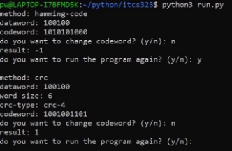
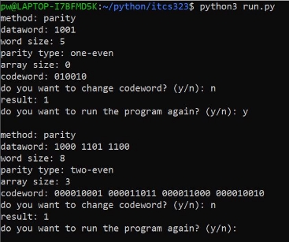

Name: Poomrapee Wareeboutr     ID: 6388113     Section: 2 

**Instruction** 

1. **How to run the program** 

**Figure 1**: the example of a command to run the program** 

Extract the  src  folder and run the program using commands to run the python script. You can see an example of the command in figure 1. 

2. **How to input** 

**Figure 2:** Appearance of the program 

Basically, when the program is called, the program would ask the user to input the information to perform the calculation. Input lines might be different depending upon the method the user chooses. 

**Figure 3:** Different input lines between Hamming Code and CRC method. 

**Input and Output** 

**Parity Check** 

**Figure 4:** Example of input and output of Parity Check** 

**Input:** 

**dataword:** the dataword that the user needs to input can be a 1 or 2-dimensional array. 

i.e., 1-dimension dataword: 100101 

i.e., 2-dimension dataword: 100101 110101 100001  

**word size:** the word size used to adjust the number of bits of the dataword. 

i.e., word size: 8 

**parity type:** used to determine what type of parity would be applied. 

i.e., parity type: one-even 

i.e., parity type: two-odd  

**array size:** array size is needed when a 2-dimension dataword is input to determine the row of the dataword array 

i.e., array size: 3 

**Output:** 

**result**: determine whether the codeword that sends to the receiver is lost the data or not, 1 no error and 0 for there is an error occurs. 

Name: Poomrapee Wareeboutr     ID: 6388113     Section: 3 

**Cyclic Redundancy Check** 

**Figure 5:** Example of input and output of CRC** 

**Input:** 

**dataword:** the dataword that the user needs to input must be a 1-dimensional array. 

i.e., 1-dimension dataword: 100101  

**word size:** the word size used to adjust the number of bits of the dataword. 

i.e., word size: 8 

**CRC type:** used to determine what type of parity would be applied. 

i.e., CRC type: crc-4 

i.e., CRC type: crc-8 

**Output:** 

**result**: determine whether the codeword that sends to the receiver is lost the data or not, 1 no error and 0 for there is an error occurs. 

i.e., result: 1 

**Hamming Code** 

**Figure 6:** Example of input and output of Hamming Code** 

Name: Poomrapee Wareeboutr     ID: 6388113     Section: 3 

**Input:** 

**dataword:** the dataword that the user needs to input must be a 1-dimensional array. 

i.e., 1-dimension dataword: 100101   

**Output:** 

**result**: determine whether the codeword that sends to the receiver is lost the data or 

not, 1 no error and the position on the dataword for there is an error occurs. 

i.e., result: 1 

i.e., result: 7 

**Checksum** 

**Figure 7:** Example of input and output of Checksum** 

**Input:** 

**dataword:** the dataword that the user needs to input must be a 1-dimensional array. 

i.e., 1-dimension dataword: 100101  

**word size:** the word size used to adjust the number of bits of the dataword. 

i.e., word size: 8 

**number of blocks:** the number of the block the user wants to split the dataword into the section. 

i.e., number of blocks: 3 

**Output:** 

**result**: determine whether the codeword that sends to the receiver is lost the data or not, 1 no error and 0 for there is an error occurs. 

i.e., result: 1 

i.e., result: 0 
